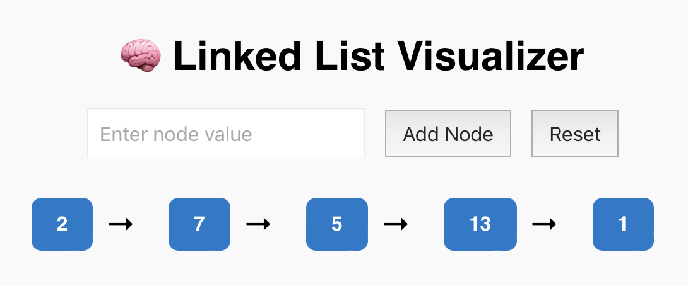

# 🔗 Linked List Visualizer

An interactive React-based web application that **visualizes how a singly linked list works**. Users can add, reset, and observe the live structure of a linked list, helping learners and recruiters alike understand data structures through UI.

Adapted from the original C-style Linked List code in my GitHub repo below:
📁 **GitHub Repo:** [https://github.com/TrishaAndres/c-linked-list](https://github.com/TrishaAndres/c-linked-list)



---

## 🚀 Live Demo

👉 [View on Netlify](https://linkedlists.netlify.app)  

---

## 🧠 Features

- ✅ Add nodes to the list dynamically
- 🔁 Watch the list grow and connect (with arrows)
- 🧼 Reset the list to start fresh
- ✨ Responsive, modern UI built with **React + CSS**

---

## 📁 Project Structure

```bash
src/
├── components/
│   ├── LinkedList.js     # Renders full list
│   ├── Node.js           # Individual node component
│   └── Controls.js       # Input field and buttons
├── styles/
│   └── App.css           # Styling for the app
├── App.js                # Root app logic
└── index.js              # Entry point
```

---

🛠 Technologies

⚛️ React – UI rendering and state management
🎨 CSS – Layout and responsive styling
🔀 uuid – Unique ID generator for node keys

---

💻 Getting Started

1. Clone the repo

git clone https://github.com/TrishaAndres/linked-list-visualizer.git
cd linked-list-visualizer

3. Install dependencies

npm install

5. Run the development server

npm start

Visit http://localhost:3000 in your browser.

---

📚 What You’ll Learn from This Project

How linked lists work under the hood
How to simulate data structures visually using React state
